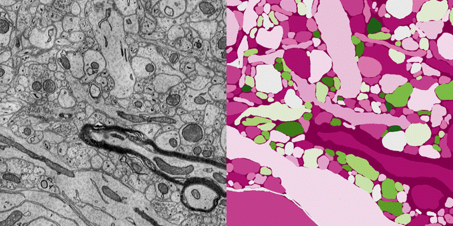

# iTran
Image2Image Translation Suite

----------

- [x] Architecture of U-net 

https://github.com/tensorpack/tensorpack/blob/master/docs/casestudies/colorize.md

- [x] Architecture of FusionNet 

- [x] Architecture of Tiramisu 

https://github.com/keras-team/keras-contrib/blob/master/keras_contrib/applications/densenet.py

- [x] Architecture of SegCaps 

https://github.com/lalonderodney/SegCaps/blob/master/capsnet.py 

----------

- [ ] Compare training curves     

- [ ] Compare testing images

----------

- [x] Data ISBI 2012 http://brainiac2.mit.edu/isbi_challenge/home 

{.center}

- [x] Data ISBI 2013 http://brainiac2.mit.edu/SNEMI3D/

{.center}
